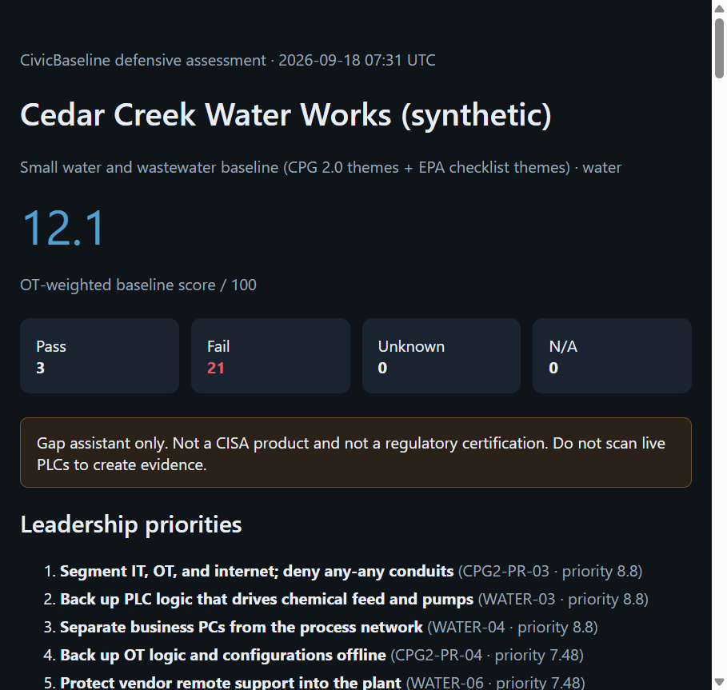

# CivicBaseline

Evidence engine that turns CISA CPG 2.0 into safe, prioritized actions for under-resourced water, healthcare, and energy operators.

[](https://github.com/MedhatZ/civicbaseline/actions/workflows/ci.yml)
[](LICENSE)
[](pyproject.toml)

> **Defensive only.** No active scanning of PLCs/RTUs/IEDs. No exploitation. No protocol fuzzing. Evidence you already own.



## Why

- 90% of US water systems serve fewer than 10,000 people
- CISA CPG 2.0 says *what* to do — not *how to prove it*
- Commercial OT platforms cost more than these utilities' entire IT budget
- CSET is manual, Windows-first, interview-based

CivicBaseline fills the gap: **automated evidence → gaps → safe hardening steps**.

## Features

- Reads operator-owned evidence: inventory, firewall configs, SBOM (CycloneDX/SPDX), optional passive PCAP
- Maps findings to CISA CPG 2.0 + NIST CSF 2.0 + EPA / HHS / Energy SSG **themes**
- OT-aware scoring (availability and safety over confidentiality)
- Outputs: board report, engineer checklist, SARIF, crosswalk table

## Install

```bash
pip install -e ".[dev]"
pytest
```

## Usage

```bash
civicbaseline assess --pack water --evidence fixtures/water-plant --out reports/water
```

Open `reports/water/report.html`.

- **Before:** 12.1 / 100, 21 gaps (`fixtures/water-plant`)
- **After applying the checklist:** 100 / 100 (`fixtures/water-plant-hardened`)

```bash
civicbaseline assess --pack water --evidence fixtures/water-plant-hardened --out reports/water-hardened
```

## Packs

| Pack | Coverage |
| --- | --- |
| `water` | CPG 2.0 + EPA checklist themes |
| `healthcare` | CPG 2.0 + HHS SSG themes |
| `energy` | CPG 2.0 + Energy Distribution / DER SSG themes |

```bash
civicbaseline assess --pack healthcare --evidence fixtures/hospital --out reports/hospital
civicbaseline assess --pack energy --evidence fixtures/substation --out reports/energy
```

## Contributing

See [CONTRIBUTING.md](CONTRIBUTING.md). Issues and pilot feedback welcome.

Defensive contributions only. Read [ACCEPTABLE_USE.md](ACCEPTABLE_USE.md) and [SECURITY.md](SECURITY.md).

## License

Apache-2.0. See [LICENSE](LICENSE).

Not a CISA, EPA, HHS, or NIST product. Independent open-source gap assistant — not a regulatory certification.
